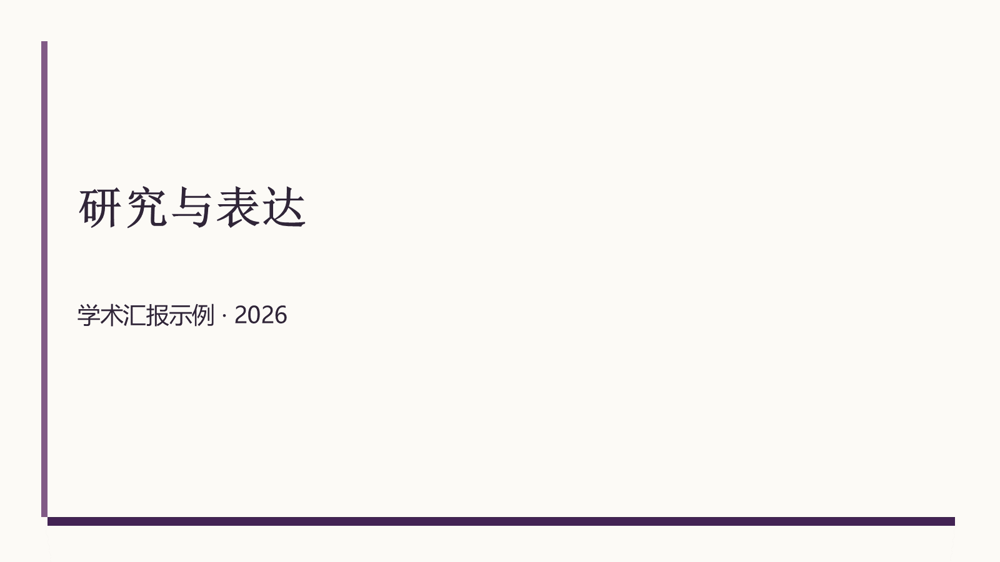
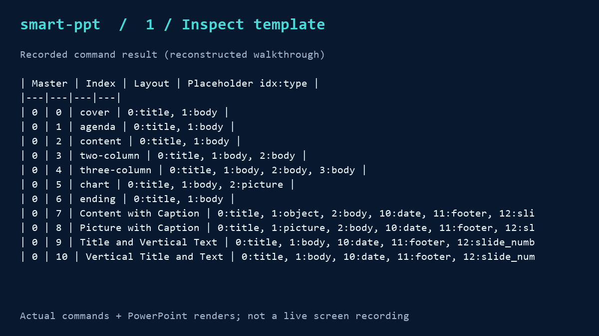
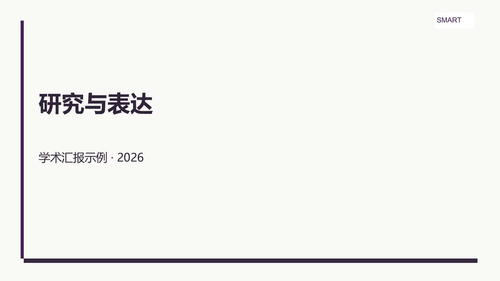

# smart-ppt 中文使用指南

完整模板优先的 PPT 制作 Skill，支持模板套用、素材创作与六种自由风格。

简体中文 | [English](README.md) · [技能入口](SKILL.md)

## 自己放模板，按需求增删改

**公开项目不附带学校或公司模板。** Clone 后，把自己的完整 `.pptx` 文件或模板文件夹放进 `templates/`，每份文件都是独立备选。选中后从整份原稿开始，未要求删除的页面全部保留。

```sh
git clone https://github.com/Dolphin2026-stl/smart-ppt.git
cd smart-ppt
python -m pip install -r requirements.txt
```

目录示例：

```text
templates/
  我的学校/
    答辩蓝色.pptx
    答辩红色.pptx
  我的公司/
    工作汇报.pptx
```

```sh
python scripts/template_library.py list
python scripts/template_library.py select TEMPLATE_ID work.pptx
python scripts/layout_inspector.py work.pptx --output layouts.json --table
python scripts/template_engine.py work.pptx plan.json result.pptx
python scripts/validate_output.py result.pptx --report validation.json
```

把 TEMPLATE_ID 换成 list 返回的值。plan.json 空对象 `{}` 表示原样复制；默认 full-deck 保留全部页面。只改某一页时使用：

```json
{"edits":[{"page":0,"texts":{"13":"新的汇报标题"}}]}
```

page 从0开始，shape_id 必须以探测结果为准。需要删页才添加 delete_pages，需要复制加页或重排时填写完整 sequence。详见 [模板工作流](references/template-workflow.md)。

本地模板与生成的索引被 `.gitignore` 忽略，发布 ZIP 也默认排除它们，不会随普通 git add / 打包上传。

## 用中文直接提出需求

把完整项目放到你的 Agent 支持的技能目录，或让 Agent 读取项目中的 `SKILL.md`，然后直接说明需求：

- **套用自己的模板：**“读取 templates/ 下的全部模板，列出名称与完整页数，帮我选择适合学术汇报的一份，再根据我的内容增删改。”
- **只改部分页面：**“使用我选定的完整模板，只修改封面标题和第3页正文，其余页面与排版保留。”
- **没有模板：**“做一份简约风课程展示，根据下面的大纲安排页面。”

用户不需要手动选择脚本模式；Agent 根据已有模板、素材和风格偏好确定工作流。各宿主的技能发现目录不同，请以对应环境的配置为准。

### 模板文件怎么放

可以直接复制整个模板文件夹，保留里面的全部 `.pptx`，不需要先抽取示例页。脚本递归扫描子文件夹，每份完整 PPTX 都作为备选。

选中模板后再根据实际内容决定哪些页保留、删除、修改或复制新增；未要求删除的页面默认保留。工作稿和成品建议放在 `templates/` 之外，避免再次被识别成模板。

## 三种模式

| 模式 | 输入 | 默认行为 |
|---|---|---|
| 完整模板套用 | 自己的PPTX | 原稿完整保留，按用户需求增删改 |
| 创作者 | 背景/配色图、logo、字体偏好 | 构建七种可复用占位符版式 |
| 自由风格 | 内容与偏好 | 六种风格，按槽位和容量分页 |

用户不用记模式名，Agent 根据材料路由。多 Agent 可分工规划、探测、审核，同一个PPTX只有一个写入者；也可由单 Agent 串行完成。

## 自制示例

以下展示来自项目自制模板，**不代表任何学校或机构模板**。





GIF 由实际命令结果和 PowerPoint 渲染合成，不是操作实录。[示例PPTX](examples/demo-deck/template-demo.pptx) · [视频制作指引](docs/demo-video-guide.md)

### 创作者模式

```sh
python scripts/template_creator.py examples/demo-deck/creator-assets brand-template.pptx --font "Microsoft YaHei"
```



详见 [素材规范](references/creator-workflow.md)。扫描图标与字体但不自动嵌入；图表布局提供图片槽位，数据编辑需要其他工具。

### 自由风格

```sh
python scripts/style_engine.py examples/demo-deck/content.json output.pptx --style academic
```


支持 minimal、tech-blue、academic、festive-red、traditional、casual；可扩展 JSON。[风格规范](references/style-workflow.md)

## 项目结构

```text
smart-ppt/
  SKILL.md / README.md / README.zh-CN.md
  templates/          # 放入自己的完整模板文件夹，默认不跟踪
  scripts/            # 模板库、整稿编辑、创作者、风格与校验
  references/         # 三种模式与布局保护
  assets/styles/      # 六种样式配置
  assets/fonts/       # 字体映射
  examples/demo-deck/ # 自制示例
  docs/assets/        # 自制截图与GIF
  tests/              # 行为测试
```

## 兼容性与验证

Python 3.10+；本机 Codex / Windows / Python 3.13.13 / python-pptx 1.0.2 已执行。Claude Code、OpenClaw、Hermes 按通用SKILL.md设计，未逐宿主实测。可将完整目录放入目标宿主的技能搜索路径，或直接让Agent读取SKILL.md。

```sh
python -m unittest discover -s tests -v
```

文字溢出是估算，需要实际渲染复核；不应把结构校验通过称为视觉完全正确。详见 [验证范围](docs/verification.md)。

## 发布包

`python scripts/package_release.py` 生成不含用户模板的ZIP和SHA-256。仓库与发布包只包含通用代码、自制示例与文档。用户提供模板的使用授权由用户自行管理。
## 成品交付标准

正文通常不低于 14 pt；浅色底用黑色正文，深色底用白色正文。Agent 会检查模板原有图片与新内容是否相关，并在原图片形状中替换不适合的图片。每张成品幻灯片都要有讲稿备注，每份 PPTX 旁都要有逐页记录事实与图片来源的 `信息源报告.md`。详细规则见 [SKILL.md](SKILL.md) 与 [视觉规范](references/visual-standards.md)。

Windows 且已安装 Microsoft PowerPoint 时，生成后运行 `powershell -File scripts/finalize_powerpoint.ps1 -Pptx output.pptx -Plan plan.json -Audit output.pptx.audit.json`。计划 JSON 必须为每张最终幻灯片提供讲稿；缺失时脚本会停止，补齐后再交付。
